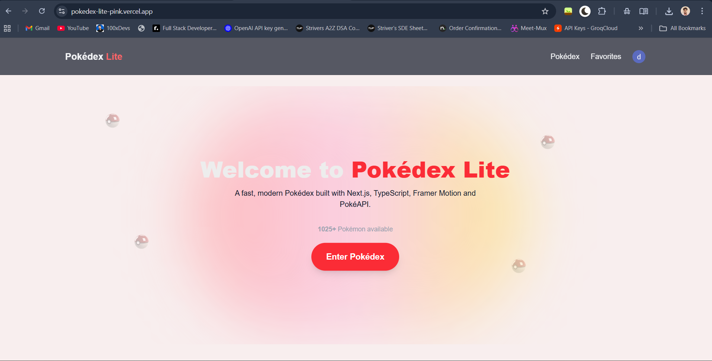
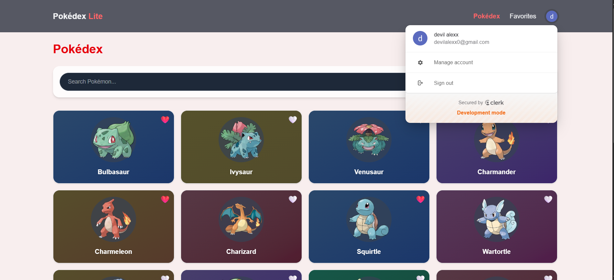
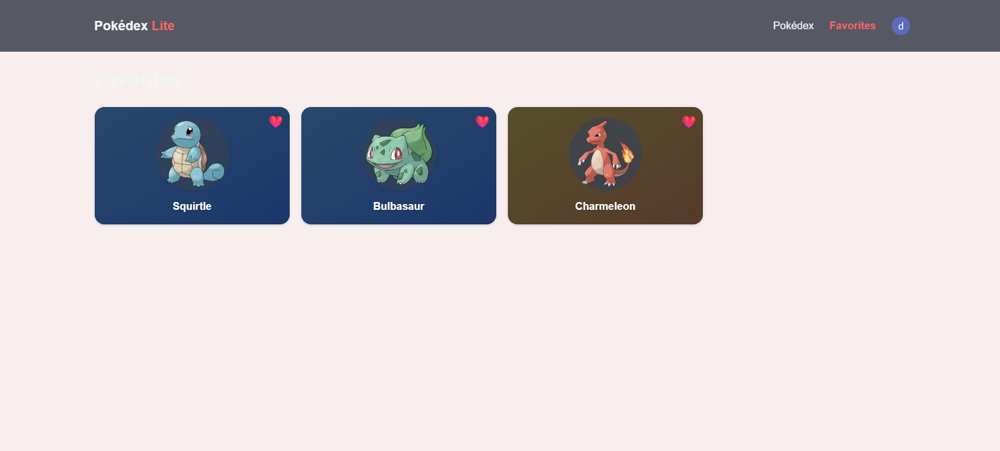
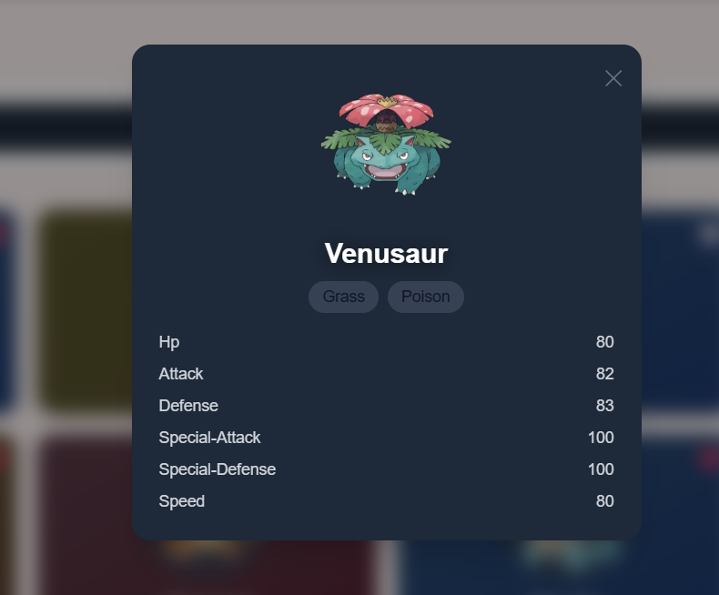

# 🧿 Pokédex Lite

A **modern, fast, and visually polished Pokédex web application** built with **Next.js, TypeScript, Tailwind CSS, Framer Motion, and PokéAPI**.

This project focuses on **excellent UI/UX**, **glassmorphism design**, **smooth animations**, and **production-ready architecture**.

---

## 🚀 Live Demo
👉 [https://pokedex-lite.vercel.app ](https://pokedex-lite-pink.vercel.app/) 

---
## 🖼️ Screenshots

### Home Page

### Pokédex Listing

### Favorites

### Pokémon Detail Modal

---

## ✨ Features

### 🧬 Core Functionality
- 🔍 Browse Pokémon with pagination
- ❤️ Add & remove Pokémon from favorites
- 🧾 Pokémon detail modal with stats
- ⚡ Fast SSR rendering with Next.js App Router

---

### 🎨 UI / UX Highlights
- 🧊 **Glassmorphism Pokémon Cards**
  - Frosted glass effect using backdrop blur
  - Translucent layers with soft borders
  - Optimized for light & dark mode
- 🌈 Deterministic gradient card backgrounds (SSR safe)
- 💫 Smooth hover and tap animations
- 🎴 Pokéball transition animation when entering Pokédex
- 🔊 Pokéball sound effect on CTA interaction
- 🟣 Page-to-page swipe transitions
- 🌙 Dark / Light mode support
- 📱 Fully responsive (mobile-first design)

---

### 🔐 Authentication
- 🔑 OAuth authentication using **Clerk**
- 👤 User profile menu
- 🔒 Favorites scoped to logged-in users

---

## 🛠 Tech Stack

| Category | Technology |
|--------|------------|
| Framework | **Next.js (App Router)** |
| Language | **TypeScript** |
| Styling | **Tailwind CSS** |
| Animations | **Framer Motion** |
| Authentication | **Clerk** |
| API | **PokéAPI** |
| Hosting | **Vercel** |

---

## 🧊 Glassmorphism Design

Glass cards are implemented using:
- `backdrop-blur-xl`
- Semi-transparent backgrounds
- Gradient aura overlays
- Soft inner highlights
- Dark-mode aware contrast

This creates a **premium frosted-glass UI** without harming performance.

---

## 🧠 Architecture Highlights

- ✅ Clear separation of server and client components
- ✅ Hydration-safe animations
- ✅ Deterministic UI (no `Math.random` in SSR)
- ✅ Lazy-loaded modals
- ✅ Performance-focused rendering strategy
- ✅ Clean, scalable folder structure

---

## 📂 Project Structure

